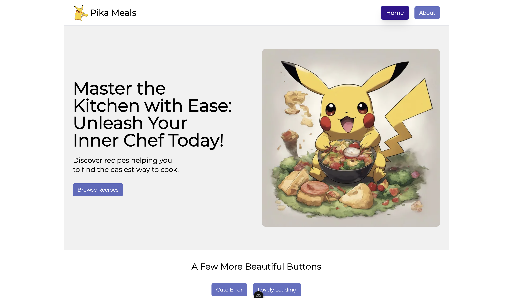

<h1 align="center" style="color: purple;">Pika Meals - Nuxt 3 Playground</h1>


## Demo
[Please visit the app](https://86f888a6.pikameals.pages.dev/)
<br/>

[](https://86f888a6.pikameals.pages.dev/)

[](https://86f888a6.pikameals.pages.dev/)
<br/>
<br/>
<br/>

## Concepts & features
- Set up Next with modules:
  - "shadcn-nuxt"
  - "@nuxtjs/tailwindcss"
  - "radix-vue/nuxt"
  - "@nuxtjs/google-fonts"
  - "@nuxt/icon"
  - "@nuxt/image"
  - "@pinia/nuxt"
- Composables
- Layouts
- useFetch
- State management (Pinia)
- Provide & Inject
- Error handling
- Spinner (loader)
- Deployment to cloudflare-pages
<hr/>
<br/>

## Todo
- Add unit tests
- Add e2e tests
<hr/>
<br/>
<br/>
<br/>


# Nuxt Minimal Starter

Look at the [Nuxt documentation](https://nuxt.com/docs/getting-started/introduction) to learn more.

## Setup

Make sure to install dependencies:

```bash
# npm
npm install

# pnpm
pnpm install

# yarn
yarn install

# bun
bun install
```

## Development Server

Start the development server on `http://localhost:3000`:

```bash
# npm
npm run dev

# pnpm
pnpm dev

# yarn
yarn dev

# bun
bun run dev
```

## Production

Build the application for production:

```bash
# npm
npm run build

# pnpm
pnpm build

# yarn
yarn build

# bun
bun run build
```

Locally preview production build:

```bash
# npm
npm run preview

# pnpm
pnpm preview

# yarn
yarn preview

# bun
bun run preview
```

Check out the [deployment documentation](https://nuxt.com/docs/getting-started/deployment) for more information.
